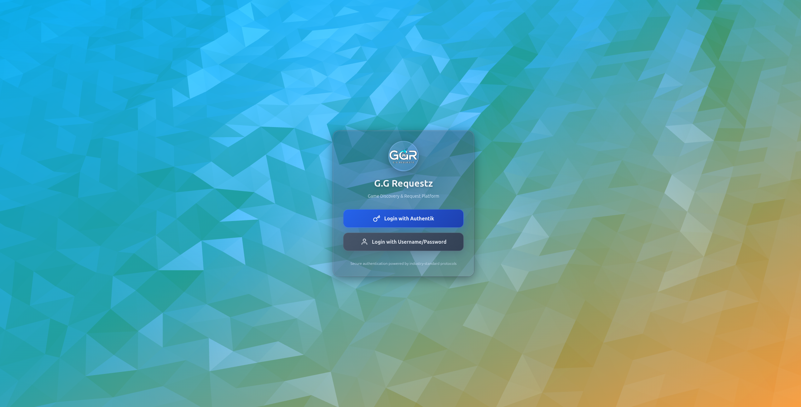
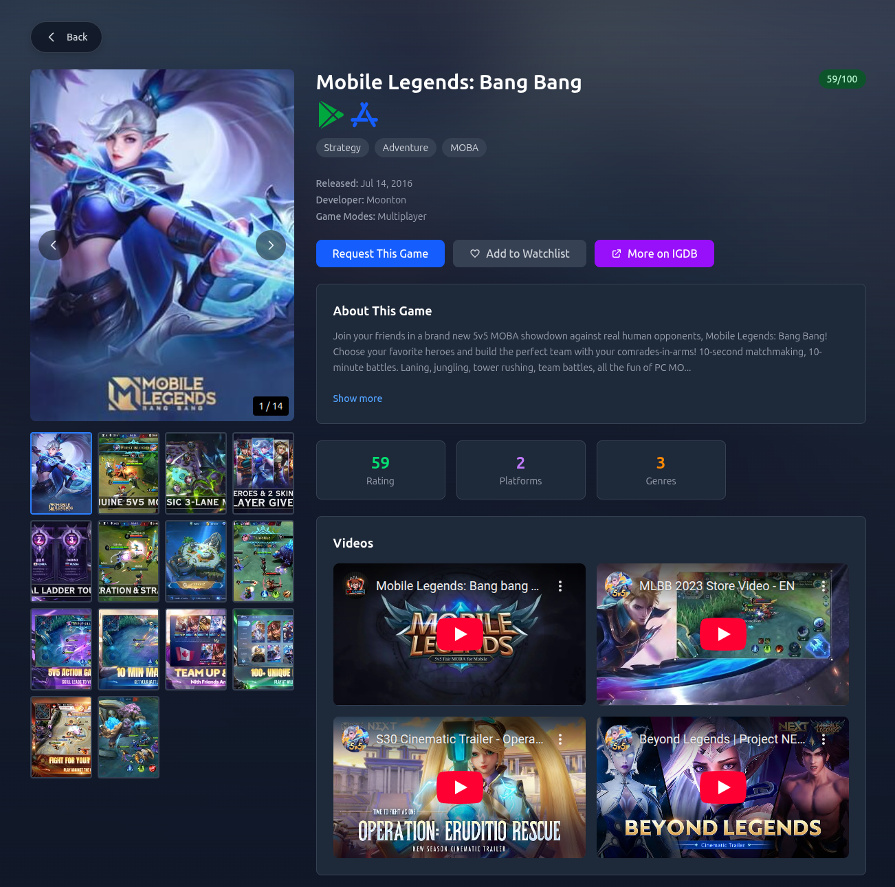
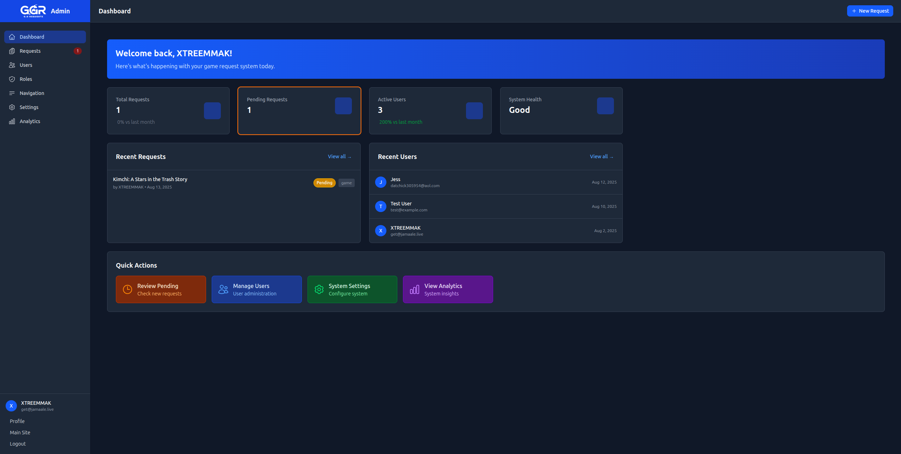
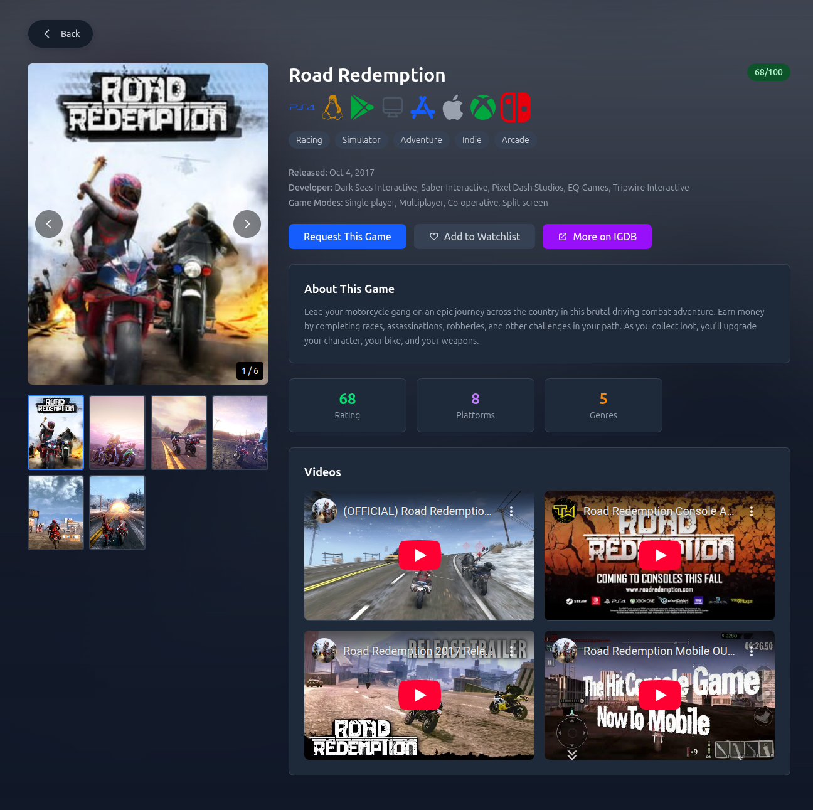
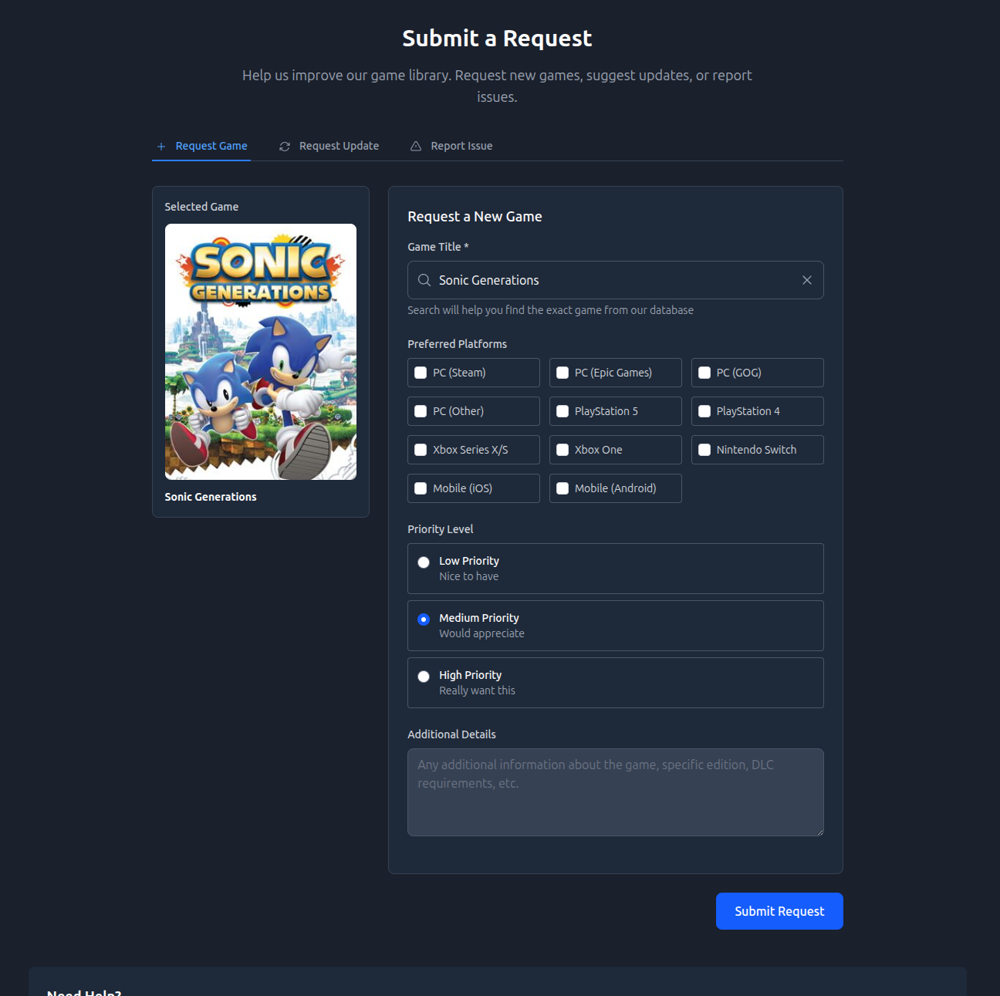
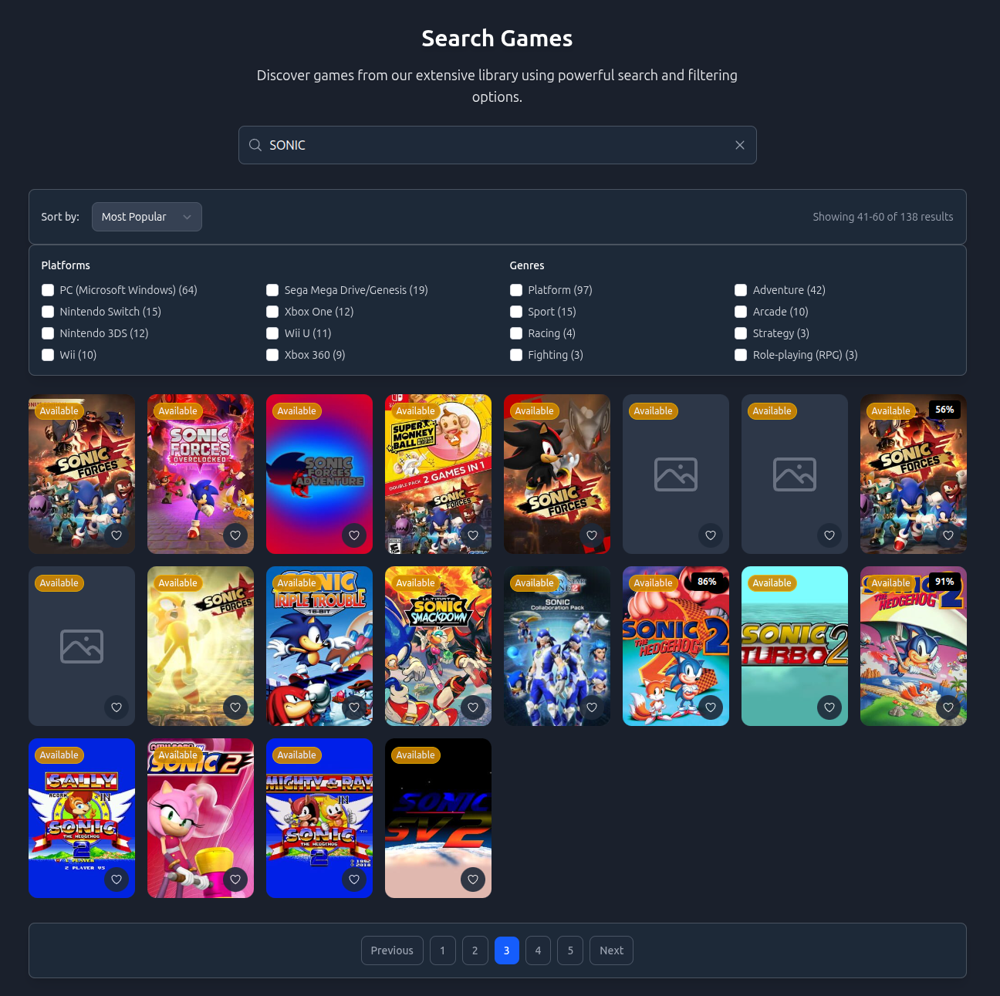
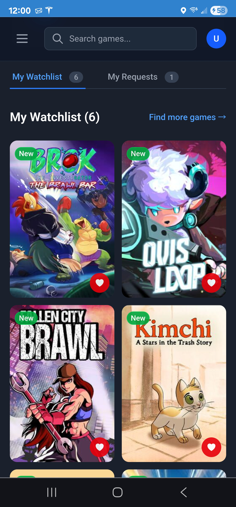
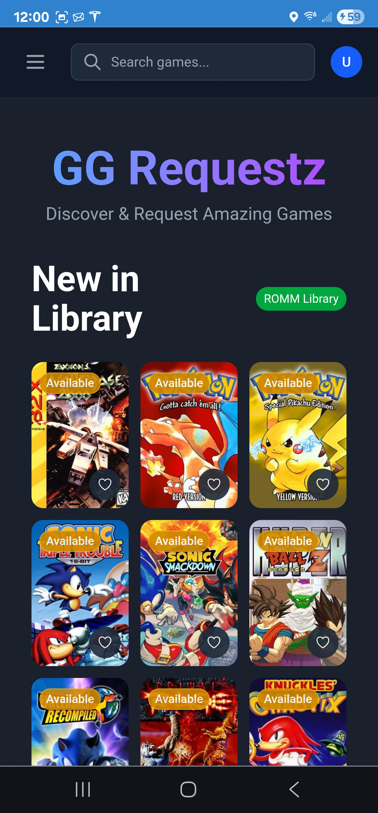

<p align="center">
  
</p>

# 🎮 GG Requestz

A modern game discovery and request management platform with IGDB integration, ROMM library support, and powerful search capabilities.


## ✨ Features

- **🔍 Advanced Search** - Search 200,000+ games with filters and real-time results
- **🛡️ Content Filtering** - Comprehensive ESRB rating filters, custom content blocks, and global game banning
- **🔒 Global Content Controls** - System-wide content filtering that supersedes user preferences for safe environments
- **📚 ROMM Integration** - Seamless integration with your ROMM game library
- **🔐 Flexible Authentication** - Any standards-compliant OIDC provider (Keycloak, Pocket ID, Authentik, Auth0, Okta, Entra ID) via discovery, plus basic auth with user registration
- **🔑 API Key Management** - Generate scoped API keys for programmatic access with Bearer token authentication
- **📚 Interactive API Docs** - Complete OpenAPI 3.1 specification with dynamic server URLs at `/api/docs`
- **⚡ High Performance** - Redis caching, hover preloading, and optimized data fetching
- **🎨 Modern UI** - Responsive design with dark mode and smooth animations

## 📹 Preview

<p align="center">
<a href="https://www.youtube.com/watch?v=dblxpNVZlqY">[VIDEO PROMO]</a>
</p>












## 🚀 Quick Start

**Get running in 5 minutes with Docker:**

```bash
# Clone repository
git clone https://github.com/XTREEMMAK/ggrequestz.git
cd ggrequestz

# Configure environment
cp .env.example .env
nano .env  # Add your IGDB credentials and settings

# Start with Docker Compose
docker compose up -d

# Visit http://localhost:3000
```

📖 **[Full Quickstart Guide](QUICKSTART.md)** | 🔧 **[Configuration Options](docs/CONFIGURATION.md)**

## 📖 Documentation

### Getting Started

- **[Quickstart Guide](QUICKSTART.md)** - Get running in 5 minutes
- **[Configuration Guide](docs/CONFIGURATION.md)** - All configuration options
- **[Deployment Guide](docs/setup/DEPLOYMENT.md)** - Production deployment

### Guides

- [Authentication Setup](docs/setup/OIDC_SETUP.md) - OIDC, Authentik, Basic Auth
- [ROMM Integration](docs/guides/INTEGRATION_GUIDE.md) - Connect with ROMM
- [Content Filtering](#global-content-filtering) - User and global filtering options
- [API Documentation](docs/API.md) - REST API reference
- [Interactive API Docs](/api/docs) - OpenAPI specification with live examples

## 🔧 Key Features Configuration

### Global Content Filtering

Administrators can enforce system-wide content restrictions that supersede individual user preferences:

- **Ban Specific Games** - Remove specific games by IGDB ID from all search results and listings
- **Keyword Blocking** - Block games containing specific keywords in their titles
- **Genre Filters** - Exclude entire genres from appearing in the system
- **ESRB Limits** - Set maximum ESRB ratings globally
- **Mature Content** - Hide mature and NSFW content system-wide

Access these controls in **Admin Panel → Settings → Content Filtering**

> **Use Case**: Perfect for family-friendly environments, educational institutions, or organizations requiring content compliance.

### Getting IGDB API Credentials

IGDB (Internet Game Database) provides the game data for G.G. Requestz. To get your API credentials:

1. **Create a Twitch Developer Account**
   - Visit the [Twitch Developer Console](https://dev.twitch.tv/console)
   - Sign in with your Twitch account (or create one if needed)

2. **Register Your Application**
   - Click "Register Your Application"
   - Fill in the required details:
     - **Name**: G.G. Requestz (or your preferred name)
     - **OAuth Redirect URLs**: `http://localhost:5174` (for development)
     - **Category**: Application Integration

3. **Get Your Credentials**
   - After registration, you'll receive:
     - **Client ID** → Use as `IGDB_CLIENT_ID`
     - **Client Secret** → Use as `IGDB_CLIENT_SECRET`

4. **Detailed Setup Guide**
   - For complete setup instructions, visit: https://api-docs.igdb.com/#getting-started
   - The IGDB API uses Twitch's OAuth system for authentication

**Note**: These credentials are required for the application to fetch game data, search results, and cover images.

## 🐳 Docker Images

Pre-built Docker images are available:

```bash
# Pull latest image
docker pull ghcr.io/xtreemmak/ggrequestz:latest

# Pull specific version
docker pull ghcr.io/xtreemmak/ggrequestz:v1.3.0
```

> **📋 v1.3.0 Release Notes:** Generic OIDC support for any standards-compliant provider via discovery, ROMM Client API Tokens, and a large cold-start performance fix. **Breaking:** `SESSION_SECRET` is now required — the app will not start without it. See the [changelog](CHANGELOG.md) before upgrading.

## 🤝 Contributing

See [CONTRIBUTING.md](CONTRIBUTING.md) for development guidelines.

## 📝 License

GPLv3 License - see [LICENSE](LICENSE) file for details.

## 🔗 Links

- [Changelog](CHANGELOG.md) - Version history and updates
- [Issues](https://github.com/XTREEMMAK/ggrequestz/issues) - Report bugs or request features
- [Discussions](https://github.com/XTREEMMAK/ggrequestz/discussions) - Questions and community support
